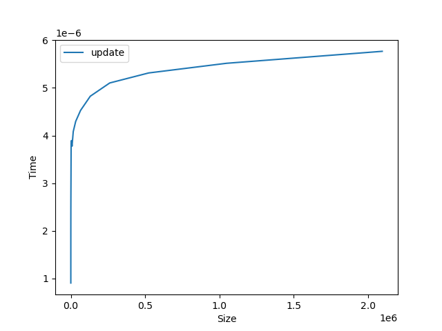

# BIT

Binary Index Tree. WIP.

## Operations:

Link plots create from running `python stats`, describe why we see `O(N)` and `O(logN)` ops. TODO: Add these in docs somewhere.

### Initialization:

(or, `BIT.create`) O(N) Operation.

##### Getting the original layout:

##### Appending an item:

##### Updating an items original value:

##### Replacing an items original value:

##### Getting an item (prefix sum):

##### Popping an item:

##### Range Sum

### Plots:

Linear complexity (create, layout)

  
   

Logarithmic complexity (append, update, setitem, getitem)

  
  
  
   

